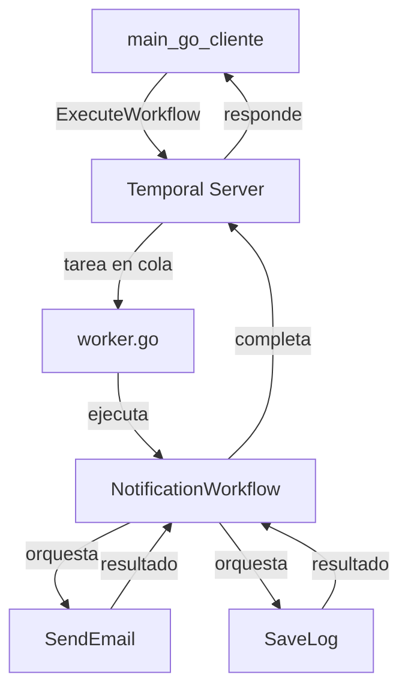

# Componentes
## 1. temporal (el servicio en Docker)
 Es el servidor Temporal. Maneja la ejecución de workflows distribuidos, maneja retries, timers, estado, persistencia, señales, etc.

Rol:

* Almacena el estado de los workflows y actividades
* Orquesta su ejecución
* Permite que workers y clientes se comuniquen con él
* Expone una API gRPC en el puerto 7233
* Trabaja con PostgreSQL como backend (u otro, como Cassandra)

**No ejecuta lógica de negocio. Eso lo hacen los workers.**

## 2. main.go (el cliente Temporal)

Es un cliente Temporal, no ejecuta workflows, solo los lanza.

Rol:

* Crea una conexión (client.Dial)
* Define las opciones del ```workflow``` (StartWorkflowOptions)
* Ejecuta un ```workflow``` con ExecuteWorkflow(...)
* (Opcionalmente) espera el resultado con .Get(...)

**Punto clave**: este programa puede ejecutarse desde un backend, CLI, API, etc. No necesita estar corriendo todo el tiempo.

```Go
we, err := c.ExecuteWorkflow(ctx, options, HelloWorldWorkflow, "Sebastián")
```

Esto le dice a Temporal: "Lanzá una ejecución del ```workflow``` llamado HelloWorldWorkflow, con este parámetro".

## 3. worker.go (el worker)
Es un worker Temporal. Es un proceso que se conecta al servidor y se registra para procesar workflows y actividades.

Rol:

* Conectarse a Temporal (client.Dial)
* Crear un worker (worker.New)
* Registrar workflows (RegisterWorkflow) y actividades (RegisterActivity)
* Escuchar una task queue específica
* Ejecutar la lógica real cuando Temporal le asigna trabajo

Siempre debe estar corriendo (o algún worker que escuche esa task queue), si no los workflows quedan en espera.

## 4. HelloWorldWorkflow (el ```workflow```)

Es una función de Go, pero está marcada como Workflow determinístico.

Rol:

* Contiene la lógica orquestada del proceso
* Solo puede usar funciones determinísticas (sin acceso directo a red, tiempo, etc.)
* Usa ```workflow```.Context, ```workflow```.Sleep, ```workflow```.ExecuteActivity, etc.

```Go
func HelloWorldWorkflow(ctx workflow.Context, name string) (string, error) {
    logger := workflow.GetLogger(ctx)
    logger.Info("Workflow iniciado")

    _ = workflow.Sleep(ctx, 2*time.Second)

    result := "Hola, " + name + "!"
    logger.Info("Resultado", "mensaje", result)
    return result, nil
}
```

En este caso:

* Duerme 2 segundos (como si estuviera esperando una tarea externa)
* Devuelve un string con el saludo
* Temporal guarda ese estado, y si se cae, puede reanudar desde donde 

## Preguntas
* ¿Qué pasa si el worker se cae? ➜ Nada grave, el ```workflow``` queda encolado hasta que un worker se registre nuevamente.

* ¿Qué pasa si el ```workflow``` falla? ➜ Temporal lo puede reintentar automáticamente.

* ¿Se puede hacer workflows más complejos con actividades y subprocesos? ➜ Sí, y es donde Temporal realmente destaca.

### 1. ¿Por qué el worker debe estar siempre corriendo?
Porque el ```worker``` es el que ejecuta la lógica real del ```workflow``` o de sus ```actividades```.

**Temporal es pull-based**

* El servidor no ejecuta nada de tu lógica de negocio.
* Solo mantiene el estado y la cola de tareas pendientes.
* Son los ```workers``` los que se conectan a Temporal y le dicen: "¿tenés trabajo para mí?".

**Si no hay workers:**

* Los ```workflows``` quedan "en espera" indefinidamente.
* La UI muestra "Running" pero no avanza.
* No se procesan actividades, ni timers, ni nada.

**Por eso: debe haber al menos un ```worker``` vivo por cada ```TaskQueue``` que esperás usar.**

### 1.a ¿Qué diferencia hay entre un Workflow y una Activity?

| Concepto   | **Workflow**                              | **Activity**                                         |
| ---------- | ----------------------------------------- | ---------------------------------------------------- |
| Define     | La **orquestación** (flujo de pasos)      | La **lógica de negocio concreta**                    |
| Corre      | Dentro del **worker** (modo determinista) | También en el **worker**, pero en su propio contexto |
| Estado     | Tiene estado persistente                  | Stateless (no guarda estado en Temporal)             |
| Reintentos | Por default no se reintenta               | Sí, con política de retries por defecto              |
| Ejecución  | Determinística y serializable             | Puede ser no determinística                          |
| Llamada    | ````workflow```.ExecuteActivity(...)`           | Código Go estándar                                   |

### 1.b ¿Cuándo se usa un Workflow y cuándo una Activity?
| Caso de uso               | ¿Workflow o Activity?          |
| ------------------------- | ------------------------------ |
| Definir el flujo completo |  🔄 Workflow                     |
| Llamar una API externa    | ⏩ Activity                     |
| Enviar un email           | ⏩ Activity                     |
| Esperar un evento o timer | 🔄 Workflow                     |
| Escribir en base de datos | ⏩ Activity (no desde Workflow) |
| Componer múltiples pasos  | 🔄 Workflow                     |

### 2 ¿Qué significa que un Workflow es determinístico?

Significa que dado un mismo input y una misma historia de eventos, siempre produce el mismo resultado.

 ¿Por qué?

Temporal persiste el historial de cada ``````workflow``````: cada decisión, ```timer```, ejecución de ```activity```, etc.
Cuando un ``````workflow`````` se reanuda (por ejemplo tras un reinicio), vuelve a ejecutar desde el principio, pero "re-ejecuta" los eventos para llegar al mismo estado.

> ⚠️ Si el código no es determinístico, puede comportarse diferente durante el replay → eso rompe todo.

#### ❌ Cosas no permitidas en workflows:

* ```time.Now()``` (usa ```workflow.Now(ctx)``` en su lugar)
* ```rand.Int()``` (usa señales o inputs para random)
* Llamadas a red, DB o APIs externas (eso va en activities)
* Acceso a variables globales compartidas


### 2.a ¿Qué otros tipos de "funciones" existen además de los workflows determinísticos?

#### 1. Workflows (determinísticos)
* Requieren seguir las reglas mencionadas
* Soportan ```replay```, señales, ```timers```, etc.
* Orquestan actividades y ```sub-workflows```

#### 2. Activities (no determinísticas)
* Ejecutan tareas reales: red, DB, filesystem
* No se re-ejecutan (se re-intentan, pero no se simulan)
* Son más parecidas a funciones comunes

#### 3. Child Workflows
* Son ```workflows``` invocados desde otros ```workflows```
* También determinísticos
* Tienen su propio historial separado

#### 4. Signals y Queries
* ```Signals```: inputs asíncronos enviados a un ``````workflow`````` desde fuera (por ejemplo desde el cliente)
* ```Queries```: permiten consultar el estado actual de un ``````workflow`````` sin modificarlo

## Ejemplo:




## URLs:
http://localhost:8233/namespaces/default/workflows
