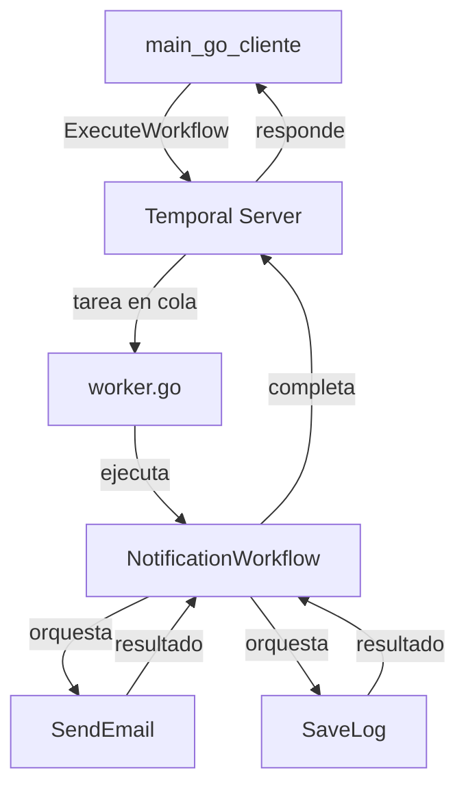

## Ejemplo
1. El cliente (main.go) lanza un workflow NotificationWorkflow.
2. El workflow orquesta dos pasos:
* SendEmail (activity)
* SaveLog (activity)
3. El worker escucha una TaskQueue y ejecuta esas actividades.

## Flujo de ejecución
### 1. Cliente (main.go)
* Se conecta al servidor Temporal (```client.Dial```)
* Lanza ```NotificationWorkflow``` con un ```EmailInput``` como argumento
* Usa ```TaskQueue: "notificaciones-queue"``` para que Temporal encole la tarea

NOTA: En la UI se puede ver el workflow con su ```Workflow ID```, ```Run ID`` y su estado

### 2. Workflow (workflowNotificationWorkflow.go)
* Recibe el input ```EmailInput```
* Define un ```ActivityOptions``` (timeouts, retries, etc.)
* Llama a ```SendEmail``` como activity con ```workflow.ExecuteActivity(...)```
* Espera a que se complete (```.Get(...)```)
* Luego repite pero con ```SaveLog```

NOTA: Temporal graba TODO lo que pasa en el workflow como historial (inputs, outputs, timers, errores)

### 3. Activities (```activities.go```)
* Son funciones normales de Go (no necesitan ser determinísticas)
* Son ejecutadas por el worker
* Pueden:
```
* Escribir en disco
* Llamar APIs
* Usar time.Now(), rand, DB, etc.
```
NOTA: Si una ```activity``` falla, el ```retry policy``` definido por el ```workflow``` se aplica.

### 4. Worker (```workerNotification.go```)
* Se conecta al servidor Temporal
* Se registra para escuchar la TaskQueue "notificaciones-queue"
* Registra:
```
* NotificationWorkflow como workflow
* SendEmail y SaveLog como activities
```
* Queda corriendo, esperando tareas

⏳ Cuando Temporal le asigna una ejecución, el worker:
* Reproduce el workflow desde el historial
* Ejecuta solo la siguiente instrucción pendiente
* Llama a la activity correspondiente


## Grafico

